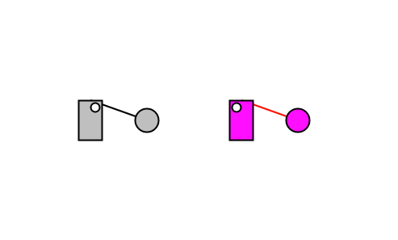

# Introduction

Lovelace is a tool for generating interactive logic diagrams and machines out of logic gates. It's
been made as primarily a teaching tool to help understand how computers work at the gate level.

Lovelace is built with a few core principals in mind:
- A picture is worth a thousand words. Show a developer how the logic they've described functions.
- Do it yourself: the standard library is minimal. If you need anything higher level, build it!
  You'll learn a ton.
- Ensure that anyone familiar with basic programming language features (such as variables,
  functions, or comments) can understand a Lovelace logic diagram.

## Why did I make Lovelace?
In school, I took an electrical engineering class. I already had a reasonably strong foundation in
software and it was interesting to see how only a few different core components could be arranged in
a few clever structures to create the massively complex computers that we use today. After the class
was over, I wanted a tool to continue learning about digital logic, but everything out there was
either prohibitively expensive, overly complex, or windows-only (I use Linux).

## Why doesn't lovelace have `X` feature?
Lovelace is built at a pretty low level. By design, you need to build most of the higher-level
primitives that you may need. In particular, these features have been left out:
- Looping / control flow with `if`: You'll have to build these. It's not as hard as you might think :smile:
- State machines: Make it yourself :smile:
- Non-wire variables: Implementing these would be prohibitively hard and it goes against the
  philosophy of do-it-yourself. Take a look at higher-level templating language if this is really
  something that you need.

If you're building something in Lovelace that is prohibitively complicated or you don't have
interest / time to lean what makes up the primitives, try out VHDL or
[Verilog](http://www.verilog.com/). These tools are made for programming FPGAs and have easy
abstrations for state machines and other common patterns.

# Introduction

Lovelace is a tool for generating interactive logic diagrams.

## Your first logic diagram

We're going to start by creating a super-simple logic diagram. It's going to consist of a led
(an indicator light) that is connected to a toggle switch. A single wire will connect from the
toggle switch to the led, and when the switch is turned on, the led will also turn on.

